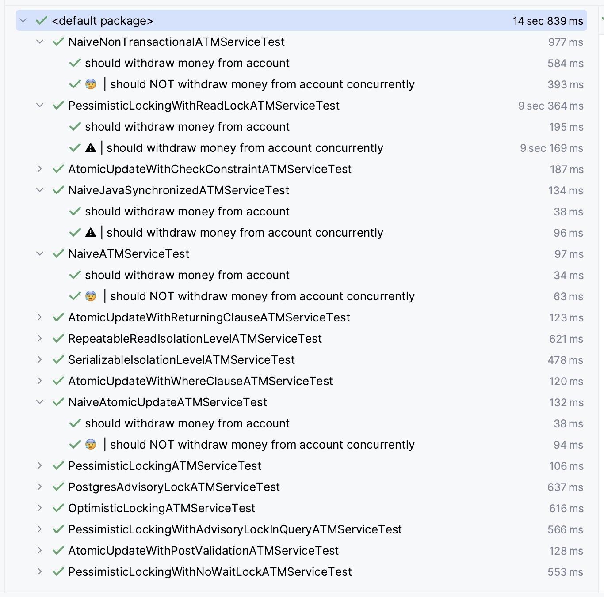

# Many ways of preveting the Lost Update anomaly

In this repository you will find more than 10 ways of preventing the Lost Update anomaly, which is a very common kind of race conditions when working with relational databases (RDBMS).

All the code here was implemented with Java, Spring Boot and Spring Data JPA with Hibernate, and tested against a PostgreSQL database. For each solution there're integration tests to prove it works or not. Although the code was written in Java, almost all the solutions here might be used in other languages, platforms and even frameworks.

**It's important to understand that all the tests were made with PostgreSQL v14.5**. So, some of the solutions may not work properly with other databases since there's suttle differences among them in how they handle concurrency, their support for SQL and database features and their own limitations. So, before assuming any of these solutions here work on your database, please, test them.

## Summary

Here are 13 ways of preventing the Lost Update anomaly (race condition) effectivly or partially in PostgreSQL using Java and Spring Data JPA with Hibernate! 🥳

📋 There're 16 scenarios in total, where:

- 🟢 11 of them prevent the anomaly;
- 🟡 2 of them **partially** prevent the anomaly;
- 🔴 3 of them do **NOT** prevent the anomaly;

To be sure that those solutions worked as expected, I wrote integration tests for each scenario 💪🏻



## Scenario: updating the account balance

Before we get into the possible solutions, we must understand the scenario with its business logic and also when the race condition can happen.

We will work on a commom scenario where the lost update can happen: **updating an account balance**. All the integration tests were made using this scenario. Basically, we have a service responsible for withdrawing money from a specific account. This services could be written in any language or framework, but what matters is how it reads from and writes data to the database.

So, the idea of the business logic in raw SQL would be something like that:

```sql
BEGIN

    -- loads the account balance by account_id
    SELECT c.balance
      INTO current_balance
      FROM account c
     WHERE c.id = :account_id
    ;

    -- checks if there's enough balance
    IF current_balance < :amount THEN
        raise exception 'there is not enough balance';
    END IF;

    -- updates the account with a new balance
    UPDATE account
       SET balance = (balance - :amount)
     WHERE id = :account_id
     ;

    -- registers the business transaction
    INSERT INTO transactions 
            (account_id, amount, description)
         VALUES 
            (:account_id, :amount, "withdraw money")
        ;

    -- commits the transaction
    COMMIT;
END;
```

Although the business logic is correct and works as expected, it's a naive implementation. I mean, it works for one single user, but the race condition may happen when 2 or more users (threads or transactions) try to withdraw money from the same account almost at the same time.


## Let's get to know each solution

🚧 UNDER CONSTRUCTION

